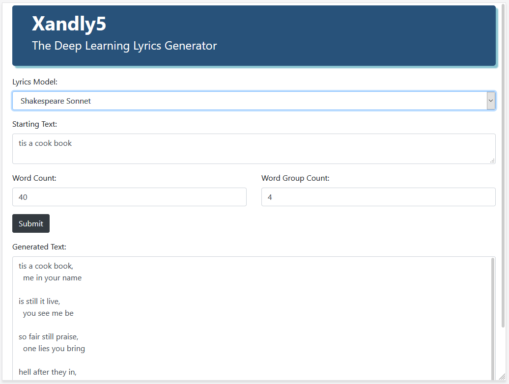
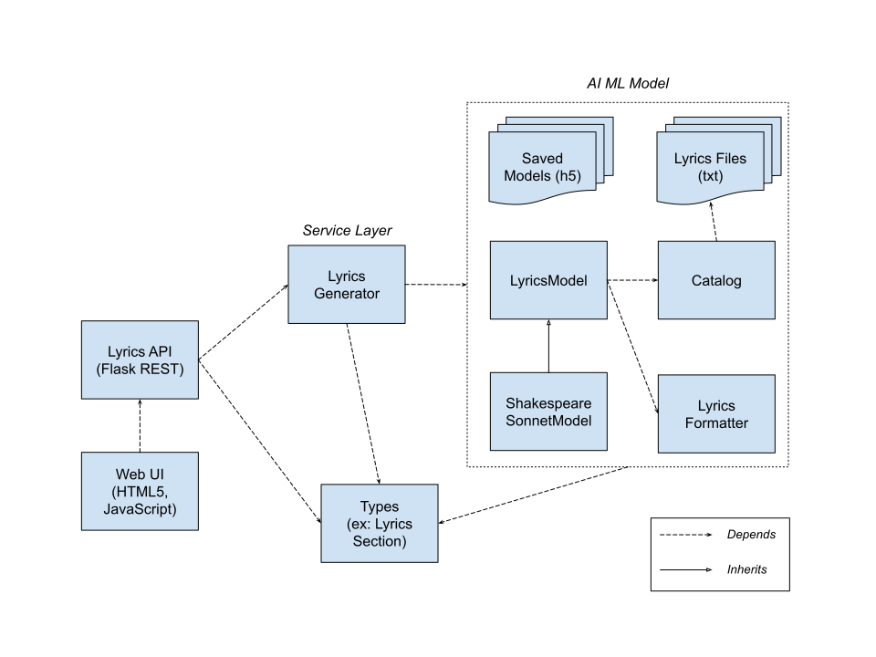

# Xandly5 - NLP Lyrics Generator

## Applied AI for Lyrics Generation using Natural Language Processing and Object-Oriented Python

> "The next big thing is a good song." 
> - [Brian Epstein](https://en.wikipedia.org/wiki/Brian_Epstein)

**Xandly5** (pronounced *zand-lee-five*) is a lyrics generator powered by Natural Language Processing (NLP) using the Keras and TensorFlow frameworks.  Deep Learning models are trained on separate collections of works to produce genre-specific output.

Users can enter starting text, word counts and grouping to generate a new song.  

For a more unique and elaborate NLP experience, Xandly5 can produce lyrics with a **user-specified song structure**, with settings for each verse, chorus, bridge, etc.  Don't forget the bridge!

This project is *not* an attempt to replace creative artists:  this would be impossible and, more importantly, unwanted.  Xandly5 is an experimental tool to empower individuals by providing a springboard for ideas in songwriting and poetry.

<p align="center">
    <a href="images/Xandly5-Screenshot.png"></a>
</p>

## Public Domain Sources

To ensure we respect copyrights, all lyrics used to train models are from public domain works.  Xandly5 currently includes separate models for:

- Shakespeare's Sonnets
- Edgar Allan Poe's Complete Poetical Works

## Natural Language Processing with Keras and TensorFlow

### Keras and TensorFlow NLP Models

The NLP models in Xandly5 are currently Keras Sequential models with Embedding and Bidirectional Long Short-Term Memory (LSTM) layers.  This allows models to take starter text specified by the user and predict the next set of words.  The LSTM layer is a Recurrent Neural Network layer that maintains memory, so that a word later in a song is influenced by earlier words.  The bidirectional capability enhances this functionality.

The modular design of Xandly5 simplifies the process of adding models, which can leverage other Deep Learning layers, techniques, and frameworks.  JSON config files are used throughout the project to streamline hyperparameter and validation configuration.

### Catalog class

The Keras Tokenizer is used to create multiple N-gram sequences for each line in a set of lyrics.  Here is an example of an N-gram sequence from the first line of Poe's *The Raven*, with corresponding text:

```
LINE: Once upon a midnight dreary, while I pondered, weak and weary,

N-GRAM                          CORRESPONDING TEXT
[1362, 27]                      once upon
[1362, 27, 5]                   once upon a
[1362, 27, 5, 285]              once upon a midnight
[1362, 27, 5, 285, 1363]        once upon a midnight dreary
...
```

The tokenizer is fitted on all lyrics associated with the catalog, and then generates and pads multiple n-gram sequences for each line.  The tokenizer converts each word in the catalog to a number.  

The `Catalog` class in Xandly5 allows us to reuse this functionality for model training, and *later word predictions* for end users, since a tokenizer with consistent vocabulary and settings is required as part of both processes.

We train models to predict the last word for each sequence (ex: *upon* in the first example above, and *dreary* in the last).  Sequences are split into training and validation groups so that we can graph performance and identify issues with over- and under-fitting.  Xandly5 makes use of the `Stopwatch` and `charts` modules from the [PTMLib](https://github.com/dreoporto/ptmlib) library.

### Model Output

The lyrics produced by these models can be considered imperfect yet hopefully inspirational.  They are consistent with each model's genre thanks to the word predictions; sometimes they rhyme.  Xandly5 output is not random, since this would produce different results with each submission.  The same exact text input to the same model, with the same word count and grouping parameters, will produce the same output, which can then be used as a springboard for ideas.  

## Xandly5 Architecture 

<p align="center">
    <a href="images/Xandly5-Architecture.svg"></a>
</p>

## `ai_ml_model`

This module contains all code and files for training and saving models, and making word predictions.

### `LyricsModel`

- Trains models and saves them as H5 files
- Specific child models currently included:
    - `shakespeare_sonnet_model.py`
    - `poe_poem_model.py`
- Each child model has an associated `*_config.json` with hyperparameter settings
- Model `.py` files can be executed to save your own custom H5 models
  - We recommend downloading the H5 models per the setup instructions below

### `Catalog`

- Used for both model training, and prediction (via the `LyricsGenerator` service)
- `catalog_items` - stores all lyrics for a corpus (i.e., collection of works)
- `generate_lyrics_text` - creates lyrics using the Catalog's associated model, tokenizer and related properties

### Additional Items
- `LyricsFormatter` - formats lyrics for readability, including commas and line breaks
- `saved_models` folder - models are stored here in H5 format
- `lyrics_files` folder - source lyrics files in TXT format

## `service`

This module provides lyrics generation logic, validations, and unit tests

### `LyricsGenerator`

- Logic for generating lyrics using pre-trained models, including input validations 
- `LyricsModelEnum` init parameter specifies which model to use
- `generate_lyrics` method creates lyrics using the specified starter text
    - `seed_text` - starter text parameter
    - `word_count` - total number of words (seed text + generated text)
    - `word_group_count` - controls the addition of commas or blank lines, alternately, after the number of specified words

#### Song Structure: the LyricsGenerator and LyricsSection classes

One feature that makes Xandly5 unique is the ability to produce lyrics with a specified song structure.  A user can create a list of `LyricsSection` song sections, each with its own seed text, word count and grouping.  

Example:

```python
sections: List[LyricsSection] = [
    LyricsSection(section_type=SectionTypeEnum.VERSE, word_group_count=4, word_count=32,
                    seed_text='a dreary midnight bird'),
    LyricsSection(section_type=SectionTypeEnum.CHORUS, word_group_count=4, word_count=16,
                    seed_text='said he art too'),
    LyricsSection(section_type=SectionTypeEnum.VERSE, word_group_count=4, word_count=32,
                    seed_text='tone of his eyes')
    ...
```

Output:
```
--VERSE--

a dreary midnight bird,
  from heaven no grace 

imparts no wrong sweet,
  human being follies dews 

here ashore ashore us,
  with friendly things at 

monarch's path my dark,
  soul eye could i 

--CHORUS--

said he art too,
  dwelt or the moon 

abated emblems said ultimate,
  vine burthen level robe 
...
```

The generated text for each section is dependent on the `seed_text` value, and text from *prior sections*, thanks to LSTM.

The `generate_lyrics_from_sections` method creates lyrics using a `LyricsSection` list

The `generate_lyrics_from_independent_sections` method creates text for each section *without* being influenced by the text in other sections.

### Unit Tests

The `tests` folder contains unit tests and related files to ensure text is generated consistently.  

IMPORTANT NOTE: You will see different results if you train models and create your own H5 files, rather than download the ones we provide in the Install process below.

## `web`

This module includes both the Web User Interface and the Flask REST API

- `lyrics_api.py` - Flask REST API
    - `/lyrics-api` - endpoint for `generate_lyrics` functionality
    - `/structured-lyrics-api` - endpoint for `generate_lyrics_from_sections` and `generate_lyrics_from_independent_sections` functionality
- HTML5 Web UI - Bootstrap, CSS, JavaScript and jQuery
    - JavaScript + jQuery code makes calls to the Flask REST API
      - jQuery has been used for a quick implementation
      - A Single Page Application using Angular or React may be implemented in the future
    - Important Files
        - `templates\index.html` - UI Structure
        - `scripts\xandly5.js` - JavaScript + jQuery code
        - `css\style.css` - UI Styling

### REST API Examples

#### `/lyrics-api`

```json
POST http://127.0.0.1:5000/lyrics-api HTTP/1.1
Host: 127.0.0.1:5000
Content-Type: application/json

{
    "model_id": 1,
    "seed_text": "tis a cook book",
    "word_count": 48,
    "word_group_count": 4
}
```

Response:
```
HTTP/1.0 200 OK
Content-Type: text/plain; charset=utf-8

tis a cook book,
  me in your name 

is still it live,
  you see me be 

so fair still praise,
  one lies you bring 

hell after they in,
  thee one date charg'd 

no effect with kings,
  and date tell it 

do in thine eyes,
  eyes lov'st back thy 
```

#### `/structured-lyrics-api`
```json
POST http://127.0.0.1:5000/structured-lyrics-api HTTP/1.1
Host: 127.0.0.1:5000
Content-Type: application/json

{
    "model_id": 2,
    "independent_sections": false,
    "lyrics_sections": [{
            "section_type": 1,
            "seed_text": "a dreary midnight bird",
            "word_count": 32,
            "word_group_count": 4
        }, {
            "section_type": 2,
            "seed_text": "said he art too",
            "word_count": 16,
            "word_group_count": 4
        }, {
            "section_type": 1,
            "seed_text": "tone of his eyes",
            "word_count": 32,
            "word_group_count": 4
        }
    ]
}
```
Response:
```
HTTP/1.0 200 OK
Content-Type: text/plain; charset=utf-8

--VERSE--

a dreary midnight bird,
  from heaven no grace 

imparts no wrong sweet,
  human being follies dews 

here ashore ashore us,
  with friendly things at 

monarch's path my dark,
  soul eye could i 

--CHORUS--

said he art too,
  dwelt or the moon 

abated emblems said ultimate,
  vine burthen level robe 

--VERSE--

tone of his eyes,
  moon to before no 

garden of a king,
  eye stood there dreaming 

see dreaming pallid hair,
  only dirges me you 

no more dew scintillating,
  desperate heart bird dewy 
```


## `types`

Custom type classes support data serialization and simplify dependencies.

- `LyricsModelMeta` - used by the `LyricsGenerator` class to store a model along with its related catalog and lyrics data on startup
- `LyricsSection`
- `LyricsModelEnum`

## Installation

The easiest way to get up and running is to use [Anaconda](https://www.anaconda.com/) for Python 3.  Miniconda is also an option if you prefer a bare-minimum setup. Be sure you have this installed first.

To install the `xandly5` source code on your local machine:
```
git clone https://github.com/dreoporto/xandly5.git
cd xandly5

conda create -n xandly5-dev python=3.10
conda activate xandly5-dev
pip install -r requirements.txt
```

Next, install the PTMLib library in your conda environment:
```
pip install --no-index -f https://github.com/dreoporto/ptmlib/releases ptmlib
```

### Download Saved Models

To ensure exact word output for the unit tests, download the `xandly5-saved-models.zip` archive here:

- [Xandly5 Releases](https://github.com/dreoporto/xandly5/releases)

Extract the saved models from the `xandly5-saved-models.zip` file and place them in the following directory:
```
xandly5\xandly5\ai_ml_model\saved_models
```

## Run Locally

- Run `lyrics_api.py` to launch the Flask development server
- Browse to `http://127.0.0.1:5000/` to view the Xandly5 Web UI and create lyrics
- Use the REST examples above to create lyrics

## Run with Docker

```
git clone https://github.com/dreoporto/xandly5.git
cd xandly5
```

- Follow the [steps above](#download-saved-models) to download the `xandly5-saved-models.zip` file and place the saved models it contains

```
docker compose up -d
```

- Browse to `http://127.0.0.1:5000/` to view the Xandly5 Web UI and create lyrics
- Use the REST examples above to create lyrics

## Conclusion

Xandly5 is an experiment in how to leverage Natural Language Processing for the creative process.

Additional models can be included in the project, with more robust NLP techniques.  This is just one step in a journey for someone who is fascinated by the process of weaving words to create something new, perhaps useful, and hopefully good.

As always, any feedback is greatly appreciated!
